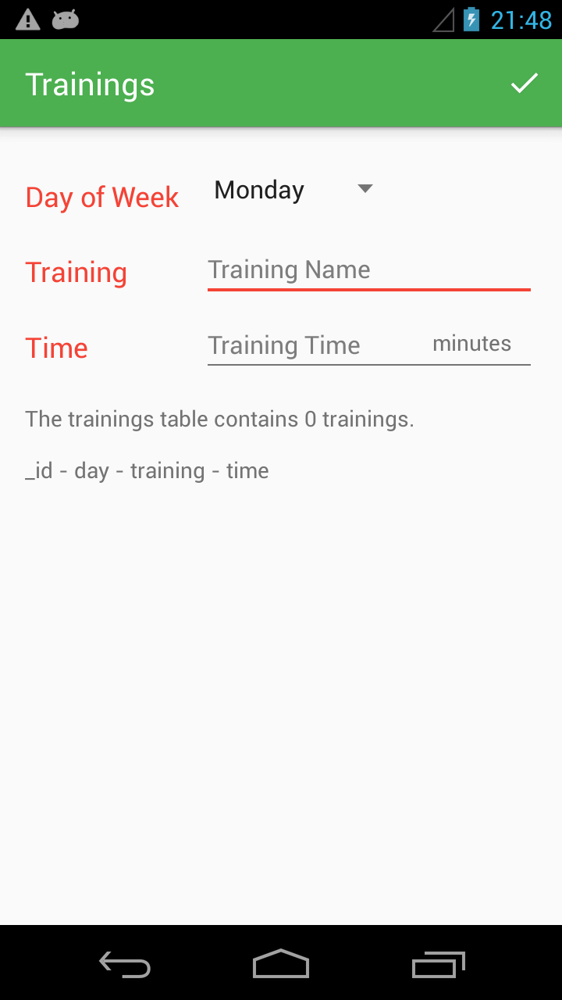
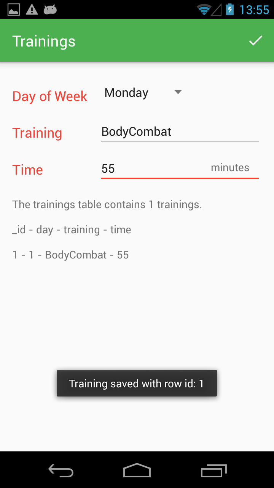
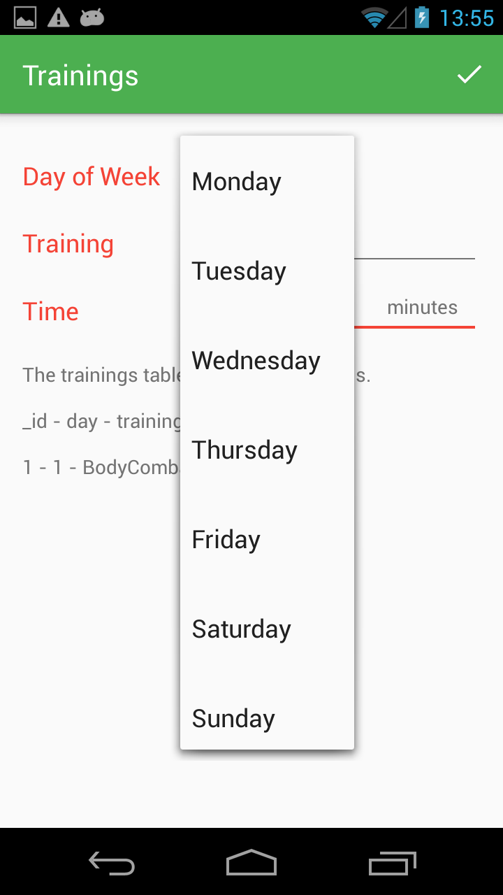
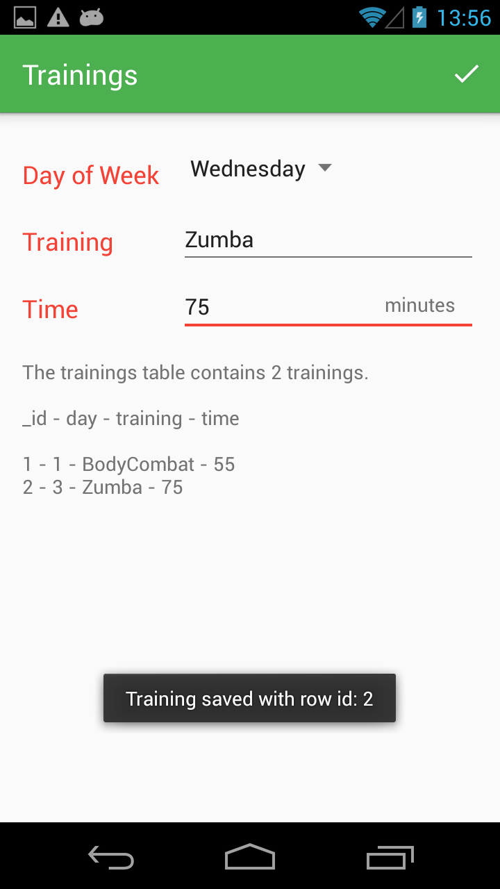
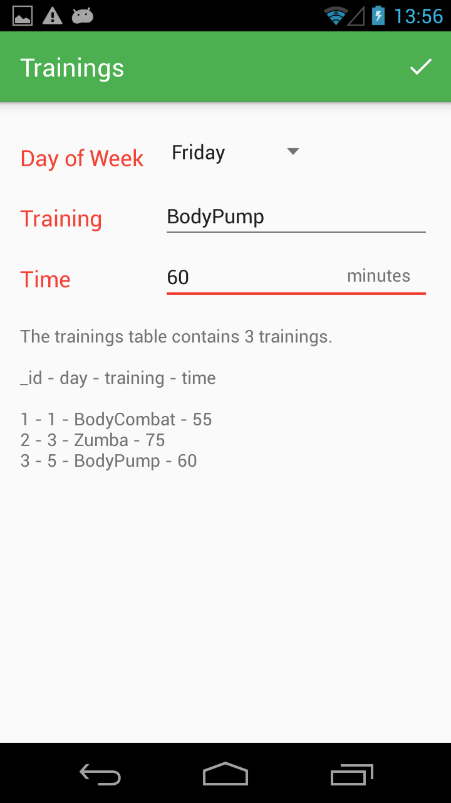
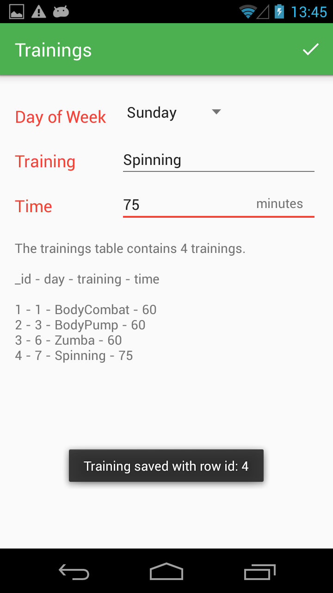

# Trainings
Trainings Habit Tracker.  

Plan daily workout through a whole week. 

Use Spinner to choose day of week. Type in Training's name and time for that day. 

Implemented a subclass of SQLiteOpenHelper to write and store trainings' data into the database and also read from the database to display users' workout plan for a whole week. 

Show a Toast message at the bottom when a training's data is successfully saved into the database. 

# App ScreenShots
      
